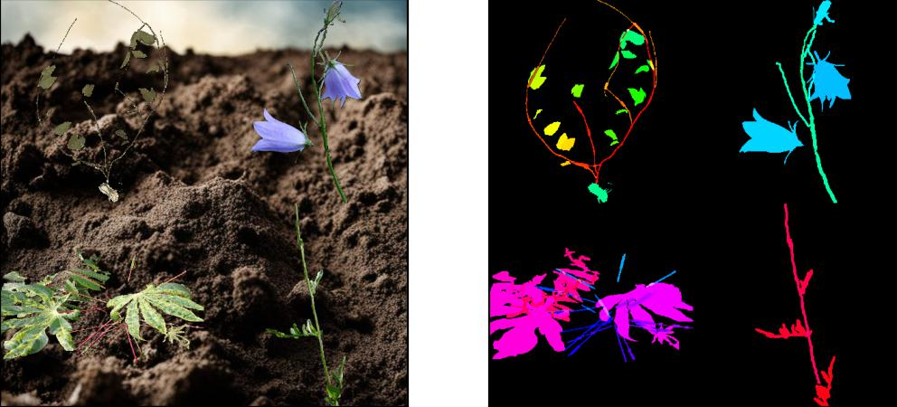
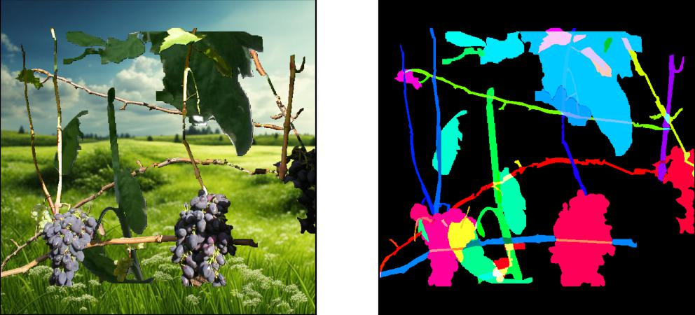

Несколько примеров удачных генераций:








Не все генерации могут подходить, и при необходимости, их можно дополнительно фильтровать.


Библиотека может работать в базовом виде без использования ГПУ. Но для работы некоторого дополнительного функционала потребуется ГПУ. 


# Формирование датасета

Примеры подготовки данных можно посмотреть в [ноутбуке dataset_preprocessing](../dataset_preprocessing.ipynb)

В директории metadat в файле metadata.py  находится json в виде объектов. Они содержат информацию об описания объектов
object_classes - название класса и какой номер ему соответствует 
object_type - тип объекта 
properties - какие свойства могут быть 
object_type2properties  - описание какие свойства могут быть у конкретного типа объекта (если в аннотации никакого нет, то по дефолту ставим нулевой из массива)

В ноутбуке dataset_preprocessing.ipynb приведен пример формирования датасета и статистик на основе собранных данных. В ноутбуке происходит вызов скриптов для формирования файлов object_statistics.csv и object_statistics.csv

id_names – уникальное имя для объекта, которое состоит из {имя_файла}_{класс}_{id_объектов} 
mask – маски в rle формате 
keypoint – ключевые точки, если они есть в разметке 
class – номер класса (например: подсолнух, ромашка, фиалка). Соотношение индексов и реальных наименований указано в файле metadata.py
class_type – номер типа объекта (часть растения). Название смотреть в файле metadata.py
height, width – высота и ширина изображения 
skeletons – skeletons в rle
centroids – centroids для маски. Массив с координатами точки [y, x]
main_diag – главная диагональ. Массив с координатами двух точек [ [x1, x2], [y1, y2]]
graph_center – центр графа. Массив с координатами точки [y, x]
alpha_horizons – угол между главной диагональю и горизонтом в градусах
tag_nums – определяет, к какому объекту относится (для одного растения они одинаковые). Пример plant_*


# Базовое использование

Примеры запусков различных базовых режимов аугментации можно найти в [ноутбуке pipeline_modes](../pipeline_modes.ipynb)


Точной входа является класс *Pipeline*. Он принимает на вход путь к конфигурационному файлу *project_config_path*.

```python
pipeline = Pipeline(
    project_config_path='configs/basic_cpu_project_config.json'
)

pipeline.prepare()
```

В результате инициализации пайплайна будет создан и настроен новый проект. Для непосредственной генерации изображений можно в цикле выполнять метод *pipeline.run()* :


```python
generated_scene, mask_part_list = pipeline.run(num_objects=4)
```

Опционально можно задать ограничения сэмплирования в параметре *default_feature_sampler_limitations*:

```python
default_feature_sampler_limitations = {
    'class_type': {
        'ne': 0
    },
    'main_diag_height': {
        'ge': 20
    },
    'main_diag_width': {
        'ge': 20
    }
}
```

Здесь:
* **class_type** ограничения на типы объектов.
* **main_diag_height** ограничения на высоту объекта. 
* **main_diag_width** ограничения на ширину объекта. 

Возможные операции:
* **isin** проверка, что входит в список.
* **le** проверка, что значение меньше или равно.
* **ge** проверка, что значение больше или равно.
* **eq** проверка, что значение строго равно.
* **ne** проверка, что значение не равно.


Для вывода более подробной информации о ходе генерации можно указать параметр *verbose=1*.
```python
pipeline = Pipeline(
    project_config_path='configs/basic_cpu_project_config.json',
    feature_sampler_limitations=default_feature_sampler_limitations,
    verbose=1
)
```

# Использование дополнительного функционала

Примеры запуска дополнительного функционала с использованием ГПУ можно найти в [ноутбуке pipeline_gpu](../pipeline_gpu.ipynb)


# Конфигурационные файлы

Базорый пример конфигурационного файла выглятит следующим образом:

```json
{
    "device": "cpu",
    "composition_mode": "modification",
    "blending_mode": "base",
    "object_prefix": "plant_",
    "dataset_names": [
        "Tomato detection"
    ],
    "result_sizes": [
        [640, 640]
    ],
    "augmentations_config_path": "./configs/augmentation_config.py",
    "background_generation": {
        "storage_path": "./tmp_data/background_storage/",
        "requires_model": true,
        "samples_per_dataset": 3
    },
    "force_repreparation": false,
    "sampling": {
        "num_objects_per_image": "random_from_data",
        "object_schema_mode": "random_from_data"
    },
    "object_placement": "uniform_2d"
}
```

* **device** это тип устройства, на котором будет запускаться код.
    - *cpu* - запуск без ГПУ.
    - *cuda* - запуск с ГПУ.
* **composition_mode** режим создания схемы объектов.
    - *modification* - модификация существующих объектов.
    - *creation* - создание новых объектов.
* **object_prefix** префикс, которыс обозначены объекты в датасете.
* **blending_mode** режим объединения объекта и фона.
    - *base* - простое копирование объекта.
    - *poisson* - пуассоновское встраивание объекта (требует наличия ГПУ).
* **dataset_names** выбор используемых датасетов из заранее подготовленных.
    - принимает список названий датасетов.
* **result_sizes** допустимые размеры итогового изображения.
    - принимает список элементов вида: (высота, ширина).
* **augmentations_config_path** путь к конфигурационному файлу аугментации.
* **background_generation** это группа параметров для генерации новых фонов.
    - *storage_path* - путь к папке с фонами.
    - *requires_model* - способ увеличения изображения.
        - *true* - изображение будет увеличиваться до необходимого размера с помощью нейронной сети (требует наличия ГПУ). 
        - *false* - изображение будет увеличиваться интерполяции.
    - *samples_per_dataset* - количество фонов, которое нужно сгенерировать для каждого датасета.
* **force_repreparation** определяет использование фонов.
    - *false* - если в папке *storage_path* уже есть изображения, то для фона будут использоваться они.
    - *true* - будут сгенерированы новые фоновые изображения (требует наличия ГПУ).    
* **sampling** это группа параметров для сэмплирования данных.
    - *num_objects_per_image* - способ выбрать количество объектов, если оно не указано в методе run(). *random_from_data* или константа.
    - *object_schema_mode* - способ составить схему объекта.
        - *random* - случайный выбор.
        - *random_from_data* - выбор на основе распределения в датасете.
* **object_placement** способ расположения объектов на изображении.
    - *uniform_1d* - равномерное распределение по горизонтали.
    - *uniform_2d* - равномерное распределение по горизонтали и вертикали.
    - *random* - случайное расположение.
    - *no_overlap* - случайное расположение с проверкой на пересечение объектов. Метод будет стараться расположить объекты без пересечений, но отсутствие перечечений не гарантировано.


Конфигурация аугментации производится в файле с разрешением **.py**, который указан в *augmentations_config_path*. Набор аугментаций перечислен в списке *aug_list*.
Пример возможного правила аугментации:


```python
{
    'target': ['object_part'],  # background object object_part
    'terminate': False,  # If this augmentation applied, other are not considered
    'apply_to_classes': 'all',  # 'all' or list
    'apply_to_object_types': 'all',
    'apply_to_tags': 'all',
    'exclude_classes': [],
    'exclude_object_types': [],
    'exclude_tags': [],
    'pipeline':
        A.Compose([
            A.CLAHE(),
            A.HueSaturationValue(),
        ])
}
```

* **pipeline** задаёт пайплайн аугментации на основе библиотеки [Albumentations](https://albumentations.ai/).

Остальные поля определяет будет ли применена аугментация для каждого конкретного объекта или подобъекта.
* **target** - список типов объектов, к которым применяется аугментация. Может быть: *background*, *object*, *object_part*.
* **terminate** - если *True*, то после применения этой аугментации к выбранному объекту, другие уже не применяются. 
* **apply_to_classes** - задаёт классы, к которым применяется аугментация. Может быть *all* или список.
* **apply_to_object_types** - задаёт типы объектов, к которым применяется аугментация. Может быть *all* или список.
* **apply_to_tags** - задаёт тэги, к которым применяется аугментация. Может быть *all* или список.
* **exclude_classes** - задаёт классы, к которым не применяется аугментация. Может быть *all* или список.
* **exclude_object_types** - задаёт типы объектов, к которым не применяется аугментация. Может быть *all* или список.
* **exclude_tags** - задаёт тэги, к которым не применяется аугментация. Может быть *all* или список.
